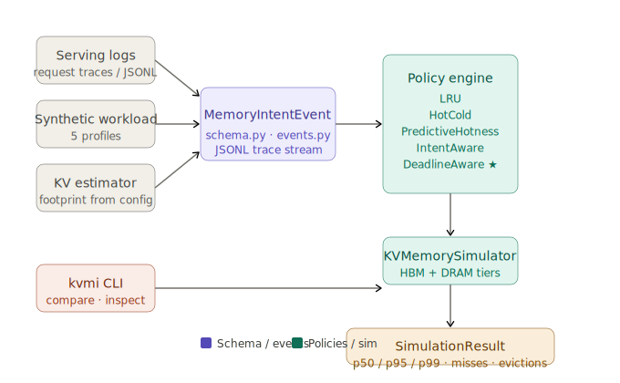

# KV Deadline Scheduler

[](https://github.com/manishklach/kv_deadline_scheduler/actions/workflows/ci.yml)
[](https://github.com/manishklach/kv_deadline_scheduler/releases)
[](https://github.com/manishklach/kv_deadline_scheduler/blob/main/LICENSE)
[](https://www.python.org/)

Deadline-aware KV-cache scheduling for long-context LLM inference memory pressure.

> KV cache is not anonymous memory. It is request-state with deadlines.

Generic memory tiering asks: "Is this page hot?"

KV Deadline Scheduler asks: "Which KV block belongs to decode-critical request-state, how close is it to missing its deadline, and what is the cost of evicting it?"

> Current results are simulated. This repository is a research prototype for external profiling, policy comparison, and I/O-priority emulation. It does not claim production speedups, real GPU memory control, or a kernel patch.

The public project name is KV Deadline Scheduler. The prototype Python package is currently named `kv_memory_intent`.



_Architecture overview: external traces and telemetry are converted into KV lifecycle events, replayed through policy variants, and extended into a Linux-first I/O-priority research track._

## What This Repo Is

KV Deadline Scheduler is a systems research prototype for deadline-aware KV-cache placement under long-context LLM inference pressure.

It defines a runtime-declared KV intent schema, estimates KV pressure from model configuration and request traces, compares access-based and deadline-aware policies under simulated HBM pressure, and explores a no-kernel-patch bridge from KV intent to Linux I/O priority classes.

The goal is to test whether deadline-aware scheduling can protect the right request-state under memory pressure better than generic LRU-style heuristics, and to explore how that intent could eventually influence storage I/O behavior.

## No vLLM Patch Required

KV Deadline Scheduler does not require modifying vLLM.

It can operate as an external KV pressure profiler using request traces, token counts, model configuration, and telemetry. vLLM is one example serving engine, not a dependency. The same workflow can be applied to other serving stacks such as TensorRT-LLM, SGLang, or OpenAI-compatible gateways.

## Project Arc

KV Deadline Scheduler explores a staged path:

- Runtime or request layer: KV blocks have request priority, phase, deadline, recompute cost, and spillability.
- External profiler layer: estimate KV pressure from request traces, model config, token counts, and telemetry.
- Scheduler layer: compare LRU, HotCold, PredictiveHotness, IntentAware, and DeadlineAware policies.
- VM path: map KV intent to `madvise`, DAMON, reclaim, zswap, and memory-tiering questions.
- I/O path: map KV intent to I/O classes such as decode-critical prefetch and background spill.
- Kernel research layer: evaluate whether Linux VM and I/O behavior can preserve the right KV state under pressure.

```text
LLM serving traces / telemetry
        |
        v
External KV pressure profiler
        |
        v
MemoryIntentEvent JSONL
        |
        v
Deadline-aware KV policy simulator
        |
        v
VM path: madvise / DAMON / MGLRU / zswap / tiering
        |
        v
KV I/O classes
        |
        v
Linux I/O priority experiment
        |
        v
Future kernel scheduler hints
```

More background:

- [docs/project_arc.md](docs/project_arc.md)
- [docs/kernel_io_scheduler_track.md](docs/kernel_io_scheduler_track.md)

## Two Experiments

### Experiment A: KV Policy Simulation

- Input: synthetic or imported request trace
- Output: policy comparison table
- Measures: simulated p50, p95, and p99 latency, decode-critical misses, evictions, spills

### Experiment B: Linux I/O Priority Emulation

- Input: synthetic critical-read and background-write workload
- Output: critical-read latency under mixed I/O pressure
- Measures: p50, p95, and p99 critical-read latency, background write throughput
- Scope: no kernel patch and no LLM runtime modification

## Current Capabilities

- Runtime-declared KV intent schema
- KV lifecycle event tracing
- Synthetic workload profiles
- External request trace importer
- OpenAI-compatible proxy log importer
- Prometheus GPU memory telemetry importer
- Mock vLLM-style trace generator for demos and regression tests
- LRU, HotCold, PredictiveHotness, IntentAware, and DeadlineAware policies
- Decision logs
- HBM pressure sweeps
- Optional plotting
- Simulated p50, p95, and p99 metrics
- Linux-first userspace I/O priority emulation benchmark
- Docs for external trace import, optional runtime instrumentation, reproducibility, and results capture

## WSL Validation Snapshot

The repository has now been exercised on a real WSL2 Linux environment and not just through unit tests.

| Track | Status | Headline result |
|---|---|---|
| Policy sweep | Ran | `deadline_pressure` `dc_miss_rate`: `lru=0.04494`, `intent=0.00281`, `deadline=0.00281` |
| Linux I/O priority | Ran | separated mode reduced worst-case critical-read latency from `48.05 ms` to `14.22 ms` |
| `madvise` VM track | Ran with limited kernel support | `MADV_WILLNEED` worked, `MADV_COLD` / `MADV_PAGEOUT` / `MADV_DONTNEED` returned `EINVAL` |
| THP | Ran | THP region measured `11005.06 MB/s` sequential versus `7516.74 MB/s` baseline |
| `perf_event_open` | Ran | miss rate rose from `2.02%` sequential to `47.44%` for KV-random access |
| raw `io_uring` | Ran | functional, but slower than sync on this WSL stack in the current prototype |
| DAMON | Blocked | `/sys/kernel/mm/damon/admin` not exposed |
| `userfaultfd` | Blocked | `vm.unprivileged_userfaultfd = 0` and this session had no non-interactive `sudo` |

Full notes and exact outputs:

- [docs/wsl_validation_2026_06_17.md](docs/wsl_validation_2026_06_17.md)

## Relationship to Linux Deadline I/O Scheduling

Linux `mq-deadline` handles storage request deadlines. KV Deadline Scheduler handles AI request-state deadlines.

A future bridge can map KV intent to I/O priorities or scheduler hints, but that bridge is still a roadmap item. There is no kernel patch implemented here and no claim of Linux scheduler improvement yet.

## VM / Memory-Management Track

KV Deadline Scheduler has two kernel-facing paths.

The VM path is closest to MEXT-like memory expansion: decide which KV-like pages stay resident, which are reclaimed, and which are candidates for cold pageout or compressed or swapped tiers. This track explores existing Linux VM mechanisms such as `madvise`, DAMON, MGLRU, zswap or swap, and memory tiering.

The I/O path begins after KV has become storage traffic and explores whether decode-critical prefetch reads should be prioritized over background spill writes.

The repository also includes kernel-facing patch designs under:

- [`kernel_patches/`](kernel_patches/)

See:

- [`kernel_vm/`](kernel_vm/)

## Quickstart

Install the package and run the test suite:

```bash
pip install -e .[dev]
pytest
```

KV simulation:

```bash
kvmi demo --profile deadline_pressure
kvmi estimate-kv --model llama-3-8b --prompt-tokens 128000 --generated-tokens 1000
kvmi import-request-trace --requests examples/sample_request_trace.jsonl --model llama-3-8b --out imported_trace.jsonl --logical-block-mb 1
kvmi compare --trace imported_trace.jsonl --hbm-mb 4096 --dram-mb 65536
```

Linux I/O priority emulation:

```bash
python experiments/linux_io_priority/kv_io_priority_bench.py --mode baseline --duration-sec 10 --dir /tmp/kvio
python experiments/linux_io_priority/kv_io_priority_bench.py --mode separated --duration-sec 10 --dir /tmp/kvio
```

For reproducible runs and result capture:

- [docs/reproducibility.md](docs/reproducibility.md)
- [docs/results_template.md](docs/results_template.md)
- [docs/wsl_validation_2026_06_17.md](docs/wsl_validation_2026_06_17.md)

## External KV Estimation

KV footprint estimates are based on model configuration, attention structure, token counts, and dtype width.

Example:

```bash
kvmi estimate-kv \
  --model llama-3-8b \
  --prompt-tokens 128000 \
  --generated-tokens 1000 \
  --json
```

These estimates are approximate and intended for external profiling and simulation.

## External Request Trace Import

Request traces are imported from JSONL records such as `examples/sample_request_trace.jsonl`.

Use the importer to reconstruct approximate KV lifecycle events:

```bash
kvmi import-request-trace \
  --requests examples/sample_request_trace.jsonl \
  --model llama-3-8b \
  --out imported_trace.jsonl \
  --logical-block-mb 1
```

Then inspect and replay:

```bash
kvmi inspect --trace imported_trace.jsonl --head 5
kvmi compare --trace imported_trace.jsonl --hbm-mb 4096 --dram-mb 65536
```

Imported traces are intentionally approximate. They are reconstructed from external logs and model metadata, not from runtime-internal allocation events.

## Policy Matrix

| Policy | Access history | Inferred hotness | Request priority | Deadline | Phase |
|---|---:|---:|---:|---:|---:|
| LRU | Yes | No | No | No | No |
| HotCold | Yes | Yes | No | No | No |
| PredictiveHotness | Yes | Yes | No | No | No |
| IntentAware | Yes | Partial | Yes | Limited | Yes |
| DeadlineAware | Yes | Partial | Yes | Yes | Yes |

## Example Decision

Illustrative example under HBM pressure:

| Policy view | Candidate block | Why it gets evicted |
|---|---|---|
| LRU | `req_7:block_44` | It looks old by recency, even though it belongs to decode-critical request-state with a near deadline. |
| DeadlineAware | `req_12:block_88` | It is a cold, low-priority prefill block with no near deadline and acceptable recompute cost. |

Representative metadata:

```text
req_7:block_44
  phase=DECODE
  priority=DECODE_CRITICAL
  deadline_us=900

req_12:block_88
  phase=PREFILL
  priority=COLD
  request_priority=20
  deadline_us=none
  recompute_ok=true
  expected_reuse_window_tokens=512
```

This is the core thesis. Both are memory blocks, but they are not equally valuable request-state.

## What This Repo Is Not

- Not a production vLLM scheduler
- Not a kernel driver
- Not a real GPU HBM controller
- Not a production CXL or NVMe tiering stack
- Not a production Linux I/O scheduler
- Not a KV compression method

## Roadmap

See:

- [docs/roadmap.md](docs/roadmap.md)
- [docs/blog_draft.md](docs/blog_draft.md)

## Repository Layout

| Path | Purpose |
|---|---|
| `src/kv_memory_intent/` | Core schema, simulator, policies, metrics, CLI, and adapters. |
| `tests/` | Regression coverage for schema, simulator behavior, adapters, and CLI-facing flows. |
| `examples/` | Small demos for policy comparison, synthetic traces, plotting, and mock serving traces. |
| `experiments/linux_io_priority/` | Linux-first userspace I/O priority emulation benchmark and result notes. |
| `kernel_vm/` | Linux VM and memory-management research track, including `madvise` and DAMON experiments. |
| `docs/` | Architecture notes, project arc, reproducibility guidance, release notes, and research-track docs. |
| `integrations/external_trace/` | Request-trace and telemetry format notes for external profiling workflows. |
